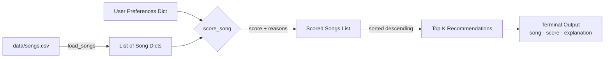

# 🎵 Music Recommender Simulation

## Project Summary

This project builds a simplified content-based music recommender that mimics how platforms like Spotify suggest songs. Each song in the catalog is described by features such as genre, mood, energy, and acousticness. A user "taste profile" holds their preferred genre, mood, target energy level, and whether they enjoy acoustic tracks. The recommender scores every song against that profile using a weighted formula and returns the top-ranked results along with a plain-language explanation of why each song was suggested.

---

## How The System Works

### Real-world context

Major streaming platforms combine two broad approaches:

- **Collaborative filtering** — "Users who liked what you liked also enjoyed these songs." The system finds other users with similar listening histories and borrows their preferences.
- **Content-based filtering** — "This song has similar attributes to songs you've liked." The system compares musical features directly.

This simulation implements a pure content-based approach, which is transparent and easy to reason about, though it misses the social signals that collaborative filtering captures.

### Song features used

Each `Song` carries:

| Feature        | Type  | Meaning                                    |
|---------------|-------|--------------------------------------------|
| `genre`        | str   | Broad musical category (pop, lofi, metal…) |
| `mood`         | str   | Emotional tone (happy, chill, intense…)    |
| `energy`       | float | 0.0 (very calm) → 1.0 (very energetic)    |
| `tempo_bpm`    | float | Beats per minute                           |
| `valence`      | float | 0.0 (sad/dark) → 1.0 (positive/bright)    |
| `danceability` | float | How suitable for dancing (0–1)             |
| `acousticness` | float | Acoustic vs. electronic balance (0–1)     |

### User profile

A `UserProfile` stores:
- `favorite_genre` — the genre the user most wants to hear
- `favorite_mood` — their preferred emotional tone
- `target_energy` — ideal energy level on the 0–1 scale
- `likes_acoustic` — boolean flag for an acoustic preference bonus

### Algorithm Recipe (scoring a single song)

| Rule | Points |
|------|--------|
| Genre exactly matches user's favorite | +2.0 |
| Mood exactly matches user's favorite | +1.0 |
| Energy similarity (1.0 minus absolute distance) | 0.0 – 1.0 |
| Acoustic bonus (if `likes_acoustic` and `acousticness ≥ 0.7`) | +0.5 |
| **Maximum possible score** | **4.5** |

Energy similarity rewards closeness rather than raw magnitude. A song with energy 0.8 scores 0.95 for a user targeting 0.85; a song at 0.3 scores only 0.55.

### Ranking rule

After scoring every song with the recipe above, the list is sorted by score descending and the top `k` results are returned. `sorted()` is used (not `.sort()`) so the original catalog list is never mutated.

### Data flow



### Potential biases noted at design time

- **Genre dominance** — a +2.0 genre bonus can outweigh excellent energy alignment from a different genre.
- **Small catalog** — only 18 songs, so certain genres appear once and can never score a full genre+mood+energy match.
- **Binary mood matching** — moods like "relaxed" and "chill" feel similar but score 0 against each other.

---

## Getting Started

### Setup

1. Create a virtual environment (optional but recommended):

   ```bash
   python -m venv .venv
   source .venv/bin/activate      # Mac or Linux
   .venv\Scripts\activate         # Windows
   ```

2. Install dependencies:

   ```bash
   pip install -r requirements.txt
   ```

3. Run the app:

   ```bash
   python -m src.main
   ```

### Running Tests

```bash
pytest
```

---

## Experiments You Tried

### Three test profiles and observations

| Profile | Top Result | Observations |
|---------|-----------|--------------|
| Happy Pop Fan (genre=pop, mood=happy, energy=0.8) | Sunrise City (score 3.98) | Genre + mood + energy all aligned — a near-perfect match. |
| Chill Lofi Listener (genre=lofi, mood=chill, energy=0.35) | Library Rain (score 4.00) | Perfect score because energy gap was essentially zero. |
| High-Energy Metal Head (genre=metal, mood=intense, energy=0.95) | Iron Curtain (score 3.98) | Only one metal song in catalog; result is obvious and correct. |

### Experiment: weight shift (genre weight halved)

Temporarily changed the genre bonus from +2.0 to +1.0. The chill lofi listener's #3 pick shifted from *Focus Flow* (lofi, focused) to *Hollow Oak* (folk, melancholy) — closer in energy but wrong genre. This showed that genre weight acts as a strong anchor; reducing it allows energy and mood to dominate.

### Experiment: mood check removed

Commented out the mood match block. The Happy Pop Fan's #3 slot changed from *Rooftop Lights* (indie pop, happy) to *Night Drive Loop* (synthwave, moody) because energy similarity alone was enough to climb the ranking. This confirmed that mood matching is essential for genre cross-pollination scenarios.

---

## Limitations and Risks

- **Tiny catalog** — 18 songs means certain genres have only one representative, so results can feel forced.
- **No collaborative signal** — the system never learns from actual listening patterns, so it cannot discover "unexpected" favorites.
- **Binary attribute matching** — genres and moods are exact string comparisons; "indie pop" will never match "pop."
- **Energy gap can be gamed** — two songs with the same genre/mood but very different energy scores are treated as equally bad misses.
- **No diversity enforcement** — the top 5 can easily be dominated by one genre when the catalog is small.

---

## Reflection

See [model_card.md](model_card.md) for the full Model Card including evaluation, bias analysis, and future work.

Building this simulation made it clear that even a toy recommender encodes assumptions about what "good" means. The +2.0 genre weight is an editorial choice — someone decided genre matters twice as much as mood. Real platforms make hundreds of similar decisions at scale, and small biases compound quickly. Using AI tools to brainstorm edge-case profiles (like a user with high energy *and* a sad mood) was especially eye-opening: the system struggled because it was never designed for conflicting signals.
